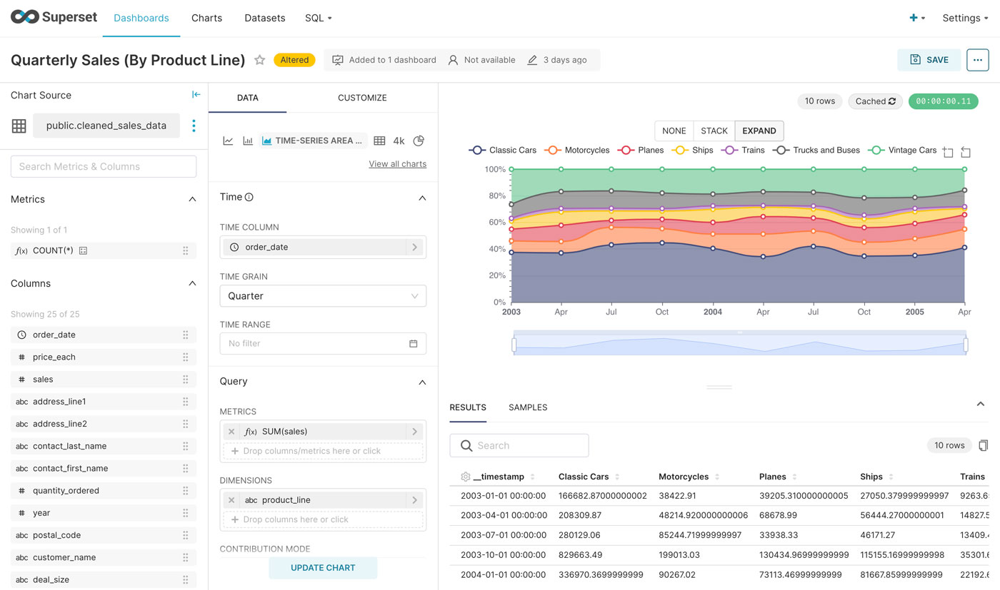

# 8.4. **사례 학습 - 클라우드 컴퓨팅에서의 데이터 엔지니어링**
- 클라우드 기반의 데이터 파이프라인: 클라우드 서비스를 활용하여 데이터를 실시간으로 수집, 변환, 로드하는 과정을 설계.
- 클라우드의 데이터 저장 기술: AWS S3, Google Cloud Storage, Azure Blob Storage 등의 클라우드 기반 데이터 저장 기술.
- 클라우드의 데이터 처리 기술: AWS Glue, Google Dataflow, Azure Data Factory 등의 클라우드 기반 데이터 처리 기술.

## 8.4.1. 클라우드 기반 데이터 환경 사례 학습
<aside>
💡 다양한 IT 기업에서 실제로 사용하고 있는 클라우드 기반 데이터 파이프라인을 살펴보겠습니다

</aside>

### 개요

- 비즈니스 의사결정을 위한 대시보드 파이프라인
    - 배치 파이프라인
- 통합 분석 환경
    - 배치 파이프라인
    - 실시간 파이프라인
- 추천 시스템
    - 실시간 데이터 파이프라인

### 1)  비즈니스 의사결정을 위한 데이터 파이프라인(KPI)

<aside>
💡 서비스 개선, 사업 의사결정, 마케팅, 경영지원을 위함
</aside>

- 주요 KPI 선정 및 KPI 대시보드 개발
- 데이터 시각화를 위한 파이프라인

출처: [Apache Superset](https://superset.apache.org/)

출처: [Apache Superset: A hidden gem in the heaps of BI tools? – Part II.](https://blog.hiflylabs.hu/en/2021/07/13/superset2/)

- `S3`: 원천 데이터(Raw Data) 저장
- `Snowflake`: 중앙 저장소
- `dbt`:  리포트에 사용될 데이터 변환작업 수행

> With dbt, data teams work directly within the warehouse to produce trusted datasets for reporting, ML modeling, and operational workflows.
> 
- `Superset`: 데이터 시각화(리포트)

### 2) 통합 분석 환경
- 통합 분석 환경 사례

#### 사례: **BigQuery로 데이터 중심의 업무 환경 구축**

> **영상 메신저 서비스 ‘아자르’를 서비스하는 하이퍼커넥트는 데이터 분석을 위해 BigQuery를 도입했습니다. 기존에는 아파치 하둡 기반으로 운영하면서 인프라가 안정적으로 운영될 수 있도록 하는 업무가 많았습니다. 하지만 BigQuery를 도입한 이후로는 데이터 분석 그 자체에 집중할 수 있게 됐고, 성능도 비약적으로 향상됐습니다. 결과적으로 데이터 기반의 비즈니스 운영이라는 목표에 한 발짝 다가설 수 있었습니다. -출처: 구글 클라우드-**
> 
- **데이터 인프라 운영보다 분석에 집중**
- **데이터 관리 체계 재정비**
- **관리형 서비스로 인프라 운영의 분리**
- **데이터 저장, 분석 전반의 비용 절감**

### 데이터 분석에 집중할 수 있는 환경

- AS-IS
    - 가상 머신 위에서 직접 데이터 플랫폼을 구축 및 운영
        - `문제점`
            - 인프라 관리와 데이터 엔지니어링에 많은 시간 소요
            - 데이터가 늘어나고 분석 과제가 늘면서 인프라 및 유지보수의 부담감이 더욱 커짐
            - 비용 측면에서도 개발과 운영이 차지하는 비용이 크게 발생함
- TO-BE
    
    > 데이터 그 자체(본질)에 집중하는 환경 구성
    > 
    - 구글 클라우드 `BigQuery` 사용(관리형 서비스)
        - BigQuery는 자체적으로 데이터를 가공해서 쿼리와 분석 처리에 최적화된 형태로 데이터를 보관함
        - 성능 측면에서도 월등한 이점을 갖음
    - 서버와 앱에서 수집되는 데이터를 통합 관리
        - `Firebase + BigQuery`
            - Firebase: 클라이언트 앱 데이터
            - BigQuery:  서비스 데이터와 클라이언트 데이터를 통합 관리

이하 자세한 내용은 [본문](https://cloud.google.com/customers/hyperconnect/?hl=ko)을 통해 살펴보실 수 있습니다

### 3) 추천 시스템

#### 사례: **BigQuery 및 Recommendation AI를 사용한 추천시스템**

출처: 29cm 기술블로그

> 1.Amplitude file이 GCS(Google Cloud Storage)에 적재되고, 매일 오전 7시마다 GCP Dataproc 에서 Spark를 통해 데이터를 가공하여 분석하기 용이한 형태로 BigQuery에 데이터 마팅을 진행합니다.

2. Amplitude 데이터의 유사한 사용자 이벤트 속성끼리 테이블 마팅을 진행합니다.

3. 마팅된 테이블로부터 Retail 서비스 학습 시 사용할 데이터 세트를 ML 프로젝트의 BigQuery로 적재합니다.

4. DE 프로젝트의 Worker 인스턴스를 통해 ML 프로젝트의 Retail 서비스로 모델 학습 시 필요한 BigQuery 테이블을 import 시킵니다.

5. Retail 서비스에서 모델 학습 후, 사용자에게 서빙을 제공하여 생성 후 모델을 평가합니다.