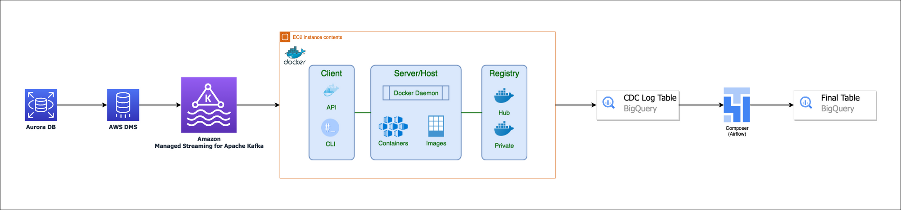

# 8.5. **멀티 클라우드 환경에서의 데이터 엔지니어링**
- 멀티 클라우드 데이터 파이프라인 설계: 여러 클라우드에서 데이터를 추출, 변환, 로드하는 전략, 각 클라우드의 특성과 서비스 고려 필요
- 멀티 클라우드에서의 데이터 보안 관리: 각 클라우드의 데이터 보안 기능 활용, 데이터 암호화, 접근 제어, 보안 그룹 등 활용
- 클라우드 간 데이터 이동 전략: 데이터 이전 전략 수립, 데이터 호환성 보장, 네트워크 비용 최소화
- 멀티 클라우드 환경에서의 데이터 엔지니어링 사례 공유

## 8.5.1. 멀티 클라우드 환경에서의 실시간 처리 파이프라인 예시

### 파이프라인 개요

Amazon Aurora Database의 변경 내역을 캡쳐하고(CDC) 캡쳐한 데이터를 Kafka Cluster Topic으로 전송합니다. Kafka Cluster에 전송된 Topic을 도커 애플리케이션의 Kafka Consumer가 읽고 BigQuery API를 사용해 CDC Log Table에 저장합니다. 마지막으로 저장된 CDC Log Table의 데이터와 Final Table의 데이터를 Merge(Update+Insert)하여 원본 데이터와 대상 데이터가 일치하도록 맞춰줍니다. 

- 구성
    - 원천 데이터베이스(Source Database): Amazon Aurora
    - 데이터 마이그레이션 서비스: Amazon DMS(Amazon Data Migration Service)
    - 이벤트 스트리밍 플랫폼: MSK(Amazon Managed Streaming for Apache Kafka)
    - 이벤트 컨슈머 애플리케이션: EC2 + Docker
    - 데이터 웨어하우스(Target Database): Google BigQuery

### `사전 지식(* Background Knowledge)`

#### 실시간 처리란?
- `실시간 처리란?`
    
    [Week 6: Data Processing Frameworks II](https://www.notion.so/Week-6-Data-Processing-Frameworks-II-3797c2ae9c5c4ac28ecddbf6b166546e?pvs=21)
    
    <aside>
    💡 지난 6번째 Session에서 다뤘던 내용을 잠시 복기해 보겠습니다!
    
    </aside>
    
    > **스트림 프로세싱(Stream Processing)**: “in motion” 이동중인 데이터의 **실시간 혹은 준실시간(near-realtime) 처리**를 의미한다. 데이터를 수집해 한번에 처리 하는 배치 프로세싱(batch processing)과 다르게 스트림 프로세싱은 연속적인 데이터 스트림을 쿼리 및 분석하고 짧은 시간(밀리초) 안에 중요한 이벤트에 대응할 수 있다.
    > 
    
    
    
    출처: [https://www.techtarget.com/](https://www.techtarget.com/)
    
    <aside>
    📌 Amazon MSK를 사용하여 스트리밍 데이터를 처리하는 애플리케이션을 손쉽게 구성할 수 있습니다
    
    </aside>
    
    ### Amazon Managed Streaming for Apache Kafka(Amazon MSK)
    
    Amazon MSK는 Apache Kafka를 사용하여 스트리밍 데이터를 처리하는 애플리케이션의 구축 및 실행을 간소화하는 완전관리형 서비스입니다. Apache Kafka는 `실시간 스트리밍 데이터 파이프라인` 및 `애플리케이션`을 구축하기 위한 오픈 소스 플랫폼입니다. Amazon MSK를 통해 네이티브 Apache Kafka API를 사용하여 데이터 레이크를 채우고, 데이터베이스와 변경 사항을 스트리밍 방식으로 주고받으며, 기계 학습 및 분석 애플리케이션을 지원할 수 있습니다.
    

#### CDC란?

- `CDC(Change Data Capture)란?`
    
    <aside>
    📌 AWS는 원본 데이터 저장소의 변경 사항을 캡쳐하는 AWS DMS 서비스를 지원합니다
    
    </aside>
    
    > 원본 데이터 저장소에서 진행 중인 변경 사항을 캡처하는 AWS DMS 작업을 만들 수 있습니다. 데이터를 마이그레이션하는 동안에도 이 변경 사항을 캡처할 수 있습니다. 작업을 생성하여 지원된 대상 데이터 스토어로 초기(전체 로드) 마이그레이션을 완료한 후 지속적 변경 사항을 캡처할 수도 있습니다. 이 프로세스를 `진행 중인 복제` 또는 `변경 데이터 캡처(CDC)`라고 합니다. AWS DMS에서는 원본 데이터 스토어에서 지속적 변경 사항을 복제할 때 이 프로세스를 사용합니다. 이 프로세스는 데이터베이스 엔진의 기본 API를 사용하여 데이터베이스 로그에 대한 변경 사항을 수집합니다.
    > 
    

### Publication/Subscription이란?
* pub/sub 이란?

    

    > **`발행-구독 모델`**은 `비동기 메시징 패러다임`이다. 발행-구독 모델에서 발신자의 메시지는 특별한 수신자가 정해져 있지 않다. 대신 발행된 메시지는 정해진 범주에 따라, 각 범주에 대한 구독을 신청한 수신자에게 전달된다. 수신자는 발행자에 대한 지식이 없어도 원하는 메시지만을 수신할 수 있다. 이러한 발행자와 구독자의 디커플링은 더 다이나믹한 네트워크 토폴로지와 높은 확장성을 허용한다. -[wiki pedia](https://ko.wikipedia.org/wiki/%EB%B0%9C%ED%96%89-%EA%B5%AC%EB%8F%85_%EB%AA%A8%EB%8D%B8)-
    > 
    - `범주란?(A.K.A Topic)`
    
    > 위의 문장에서 "각 범주"는 메시지를 분류하기 위해 사용되는 `카테고리` 또는 `주제`를 말합니다. 발행-구독 모델에서, 메시지를 특정 주제 또는 관심 영역으로 구분할 수 있습니다. 이러한 주제 또는 관심 영역은 일반적으로 "`주제`" 또는 "`토픽`"이라고도 불리며, 발행된 메시지는 이러한 주제 또는 토픽에 대해 구독을 신청한 수신자에게 전달됩니다.
    > 
    > 
    > 예를 들어, 소셜 미디어 플랫폼에서 사용자가 여러 주제에 대해 관심을 가질 수 있습니다. 사용자는 스포츠, 음악, 영화 등 다양한 주제에 대한 구독을 신청할 수 있습니다. 이때 각각의 주제는 "각 범주"에 해당합니다. 발행자는 메시지를 특정 주제에 따라 분류하고, 해당 주제에 대한 구독을 신청한 수신자들에게 메시지를 전달합니다.
    > 
    > 이러한 구조를 통해 수신자는 발행자에 대한 지식이 없어도 원하는 주제 또는 관심 영역에 대한 메시지를 구독할 수 있으며, 발행자는 메시지를 발행한 후 어떤 수신자가 해당 메시지를 받을지에 대해 신경 쓰지 않아도 됩니다. 이로써 발행자와 구독자 간의 디커플링이 이루어져 더 다이나믹한 네트워크 토폴로지와 높은 확장성을 가능하게 합니다.
    > 

    > Pub/Sub는 메시지를 생성하는 서비스를 해당 메시지를 처리하는 서비스에서 분리하는 확장 가능한 비동기 메시징 서비스입니다. -[Google Cloud](https://cloud.google.com/pubsub/docs/overview?hl=ko)-
    > 
    - Pub/Sub를 통해 서비스는 `비동기적`으로 100밀리초의 지연 시간으로 통신할 수 있습니다.
    - Pub/Sub는 데이터를 수집하고 배포하는 `스트리밍 분석` 및 `데이터 통합 파이프라인`에 사용됩니다. 이는 서비스 통합을 위한 메시징 중심 미들웨어 또는 태스크 병렬화를 위한 큐로도 효과적입니다.
    - Pub/Sub를 사용하면 **`게시자`** 및 **`구독자`**라는 이벤트 제작자 및 소비자 시스템을 만들 수 있습니다. 게시자는 동기식 리모트 프로시져 콜(RPC)이 아니라 이벤트를 브로드캐스트하여 구독자와 비동기적으로 통신합니다.
    - 게시자는 이러한 이벤트가 처리되는 방식이나 시기에 관계없이 Pub/Sub 서비스에 이벤트를 보냅니다. 그런 다음 Pub/Sub는 이벤트에 응답하는 모든 서비스에 이벤트를 전송합니다. RPC를 통해 통신하는 시스템에서 게시자는 구독자가 데이터를 수신할 때까지 기다려야 합니다. 그러나 Pub/Sub에서 비동기 통합은 전반적인 시스템의 유연성과 견고성을 높여줍니다.
    - `순차적 전달 vs 브로드캐스팅된 동시 전달`
        1. 순차적 전달 (Sequential Delivery):
            - 이벤트가 발생하면 발생한 순서대로 하나씩 전달됩니다.
            - 예를 들어, A, B, C라는 세 개의 구독자가 있을 때, 이벤트가 A에게 먼저 전달되고, A가 처리를 완료한 후에 B에게 전달되고, 다시 B가 처리를 완료한 후에 C에게 전달됩니다.
            - 이벤트는 한 명의 구독자에게 전달될 때까지 기다려야 하므로 순차적 전달 방식은 처리 속도가 느릴 수 있습니다.
        2. 브로드캐스트된 동시 전달 (Broadcast Delivery):
            - 이벤트가 발생하면 모든 구독자에게 동시에 전달됩니다.
            - 예를 들어, A, B, C라는 세 개의 구독자가 있을 때, 이벤트가 발생하면 동시에 A, B, C에게 전달됩니다.
            - 각각의 구독자는 독립적으로 이벤트를 처리할 수 있으며, 이벤트 발생 후에도 게시자는 다른 작업을 수행할 수 있습니다.
            - 브로드캐스트된 동시 전달 방식은 처리 속도가 빠르며, 구독자들이 동시에 이벤트를 받기 때문에 동일한 정보를 공유하게 됩니다.
        
        Pub/Sub 모델은 브로드캐스트된 동시 전달 방식을 사용하여 이벤트를 구독자들에게 전달합니다. 이렇게 하면 구독자들은 각자의 속도로 이벤트를 처리할 수 있으며, 게시자는 이벤트를 발행한 후에 다른 작업을 수행할 수 있습니다. 이는 처리 속도와 동시성을 개선하며, 시스템의 유연성과 확장성을 높여줍니다.
    

### 파이프라인 톺아보기

### 파이프라인 활용 예시
 

### 멀티클라우드 환경에서의 네트워크 고려사항

## Q. 좀 더 쉬운 방법은 없을까?

멀티클라우드간 실시간 데이터 전송을 쉽게 구성해주는 SaaS형 서비스도 존재합니다. 하지만 쉬운 방법이 지금 조직과 팀의 상황, 네트워크.보안 등을 고려하면 최적의 솔루션이 아닐 수도 있습니다.

