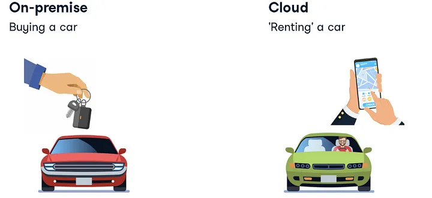
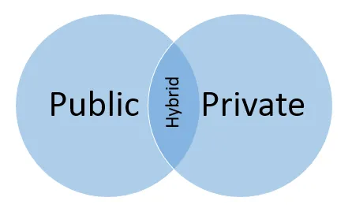

# 참고자료

## 8.1. 클라우드 컴퓨팅 기본 개념

### 렌탈카 모델과 비교

> 자동차로 비유하면 클라우드는 렌탈카와 유사하다고 할 수 있습니다

1. 리소스 공유: 렌탈카는 여러 사람이 공유하여 사용할 수 있는 자동차입니다. 비슷하게, 클라우드는 여러 사용자가 가상화된 리소스를 공유하여 사용할 수 있습니다. 여러 조직이나 개인이 클라우드 서비스 제공업체를 통해 컴퓨팅 리소스를 공유하고 필요에 따라 사용할 수 있습니다.

2. 유연성과 확장성: 렌탈카는 필요에 따라 유연하게 대여할 수 있는 자동차입니다. 비슷하게, 클라우드는 필요에 따라 컴퓨팅 리소스를 유연하게 조정하고 확장할 수 있습니다. 클라우드는 필요한 만큼의 리소스를 제공하고, 필요가 줄면 리소스를 줄일 수 있어서 비용과 성능을 최적화할 수 있습니다.

3. 관리의 간소화: 렌탈카를 이용하면 자동차의 유지보수, 보험 등의 관리를 개인이 직접 신경쓰지 않아도 됩니다. 비슷하게, 클라우드는 사용자가 인프라의 관리와 유지보수에 대해 걱정할 필요가 없습니다. 클라우드 제공업체가 서버의 관리, 보안, 업그레이드 등을 처리해줍니다.

4. 사용에 따른 비용 지불: 렌탈카는 사용한 만큼의 시간 또는 거리에 대해 비용을 지불합니다. 클라우드도 사용한 만큼의 컴퓨팅 리소스에 대해 비용을 지불하는 Pay-as-you-go 모델을 제공합니다. 필요한 만큼의 리소스를 사용하고, 사용하지 않을 때는 비용을 절약할 수 있습니다.

### `클라우드 서비스` :

- **컴퓨팅:** 워크로드를 처리하기 위한 두뇌 제공
- **저장:** 데이터 저장 및 저장
- **데이터베이스:** 보다 구조화된 데이터 세트 저장

### `클라우드 컴퓨팅 특성` :

**1.가상화 -** 클라우드 컴퓨팅을 강화하는 기본 기술.

- 가상화

가상화는 모든 최신 클라우드 환경의 핵심이며 아래에 표시된 클라우드 인프라입니다. 모든 클라우드에서 유연성, 탄력성, 관리 용이성 및 확장성을 제공하는 단위는 기본적으로 가상 머신이 제공하는 하드웨어 독립성과 이식성을 통해 가상 머신입니다.

**2** . **비용-** 자원을 사용할 때만 비용을 지불하십시오.

> 사용한 만큼 지불
> 
- 자본 비용 없음: 하드웨어 및 소프트웨어 구매, 현장 인프라 관리비용이 발생하지 않음

기업에 따라 클라우드 도입이 비용 효율적일 수 있습니다. 최상의 솔루션은 사용 사례에 따라 다릅니다.

**3. 안정성 - 클라우드 컴퓨팅을 사용하과 동시에 안정성을 더할 수 있음**

- 안정성 제공

환경에 안정성을 구축하려면 많은 비용이 소요될 수 있습니다. 일반적으로 여러 시스템 또는 여러 데이터 센터 위치를 포함합니다. DR(재해 복구) 및 연속성 계획과 시뮬레이션을 수행해야 합니다. 많은 클라우드 공급자가 이미 여러 위치를 설정했으므로 해당 서비스를 사용하면 즉시 환경에 안정성을 추가할 수 있습니다. 서비스에서 여러 위치를 사용하도록 요청해야 할 수도 있지만 최소한 선택 사항입니다.

**4. 속도 -** 바로 사용할 수 있는 클라우드 리소스에 대한 즉각적인 액세스

- 주문형 리소스
- 빠른 설정 시간
- 몇 분 만에 서비스 배포

**5. 성능 *-*** 클라우드 시스템의 성능은 지속적으로 측정되고 모니터링됨

- 성능 모니터링
- 일정 수준의 SLA 보장

성능이 특정 수준 아래로 떨어지면 시스템이 자동으로 조정되어 필요한 경우 더 많은 용량을 제공할 수 있습니다. 서비스 수준 계약(SLA)의 존재도 이점입니다. SLA는 일정 수준의 성능을 보장합니다. 해당 수준이 충족되지 않으면 서비스 제공자는 일반적으로 일정 수준의 배상을 충족해야 합니다. 이러한 배상은 대개 지불 거절 또는 수수료 감면의 형태로 이루어집니다. 따라서 성능 자체는 보장되지 않지만 성능 부족으로 인한 비용을 완화할 수 있다는 확신이 있을 수 있습니다.

**6. 확장성 -** 필요할 때 리소스를 쉽게 추가 및 제거

- 확장성
- 스케일 업 및 스케일 아웃

예:전자상거래 사이트

피크 시간 동안 더 많은 리소스가 필요합니다. 필요에 따라 리소스 확장가능합니다.

**7. 민첩성 -** 클라우드 환경은 뛰어난 민첩성을 제공

 필요할 때 리소스를 쉽게 다시 적절하게 사용할 수 있습니다. 이를 통해 리소스가 필요한 시스템에 리소스를 추가하고 그렇지 않은 시스템에서 제거할 수 있습니다. 시스템을 쉽게 추가하여 용량을 확장할 수도 있습니다. 내부 클라우드 환경을 통해 내부 인프라 리소스를 더 잘 활용할 수 있습니다. 가상화를 사용하는 클라우드 인프라는 밀도와 인프라 활용률을 높이는 데 도움이 될 수 있습니다. 결과적으로 시스템이 유휴 상태일 가능성이 줄어듭니다.

**8. 보안 -** 데이터의 안전한 저장 및 관리
  

### 8.3. **클라우드 컴퓨팅에서의 데이터 엔지니어링**

#### 1) 비즈니스 의사결정을 위한 데이터 파이프라인(KPI)

- Apache Superset
- dbt
- Apache Superset: A hidden gem…

[Welcome | Superset](https://superset.apache.org/)

[dbt - Transform data in your warehouse](https://www.getdbt.com/)

[Apache Superset: A hidden gem in the heaps of BI tools? - Part II.](https://blog.hiflylabs.hu/en/2021/07/13/superset2/)

#### 2.)통합 분석 환경 구축

- Google Cloud

[Hyperconnect 우수사례  |  Google Cloud](https://cloud.google.com/customers/hyperconnect/?hl=ko)

#### 3) 추천 시스템

- 29cm 기술블로그

[GCP Recommendations AI(Retail) 서비스를 활용한 추천 서비스 구축](https://medium.com/29cm/gcp-recommendations-ai-retail-서비스를-활용한-추천-서비스-구축-eb68a0cd5d97)

## 8.4. 멀티 클라우드 환경

## 8.5. 멀티 클라우드 환경에서의 데이터 엔지니어링

하이브리드 클라우드에 대한 직관적인 다이어그램

- [컬리의 BigQuery 도입기 - 1부](https://helloworld.kurly.com/blog/bigquery-1/)
- [컬리의 BigQuery 도입기 - 2부](https://helloworld.kurly.com/blog/bigquery-2/)
- [An intro to Cloud Computing for Data Scientists and Data Engineers](https://medium.com/analytics-vidhya/an-intro-to-cloud-computing-for-data-scientists-and-data-engineers-96d85b4852de)

- AWS DMS를 사용하여 지속 복제를 위한 작업 생성

[AWS DMS를 사용하여 지속 복제를 위한 작업 생성 - AWS Database Migration Service](https://docs.aws.amazon.com/ko_kr/dms/latest/userguide/CHAP_Task.CDC.html)

- Definition: stream processing

[What is Stream Processing? Introduction and Overview](https://www.techtarget.com/searchdatamanagement/definition/stream-processing)

- Kafka Topic이란

[kafka강의2 | Topic이란? Pub/Sub 구조](https://pearlluck.tistory.com/289)

## 읽어보면 좋은 자료
끝으로 함께 읽어보면 좋은 자료를 첨부하고 마치도록 하겠습니다 :)

[아마존 레드시프트 vs 구글 빅쿼리 | 데이터웨어하우스 비교 | 클라우드 데이터 웨어하우스 | 스마일샤크](https://www.smileshark.kr/post/aws-redshift-vs-google-bigquery-data-warehouse-comparsion-analysis)