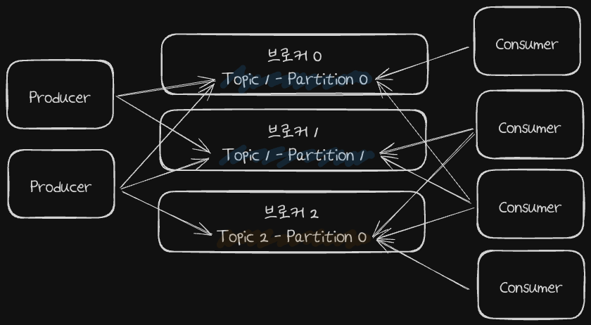
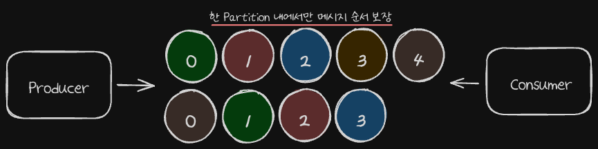

# 토픽과 파티션

## 토픽

- Topic은 메시지를 구분하는 단위로써 목적에 따라 여러 이름을 가질 수 있습니다.
  - 파일시스템의 폴더에 비유할 수 있습니다.
  - 무슨 데이터를 담고있는지 명확하게 명시하면 유지보수 시 편리하게 관리 할 수 있습니다.
  - Topic1 (X) -> purchase_log, refund_log, ... (O)
- Consumer와 Producer는 Topic을 기준으로 메시지를 주고받게 됩니다.
  - Producer: 어떤 **Topic**에 메시지를 저장해줘
  - Consumer: 어떤 **Topic**에서 메시지를 읽어올래

## 파티션

- 파티션은 메시지를 저장하는 물리적인 파일입니다.
  - 각 파티션은 여러 Segment로 이루어져있고 각각은 특정 오프셋 범위를 가집니다.
- 하나의 토픽은 한개 이상의 파티션으로 구성됩니다.
  - 파티션은 하나의 토픽을 물리적으로 분할한 것입니다.
  - 첫번째 파티션 번호는 0번부터 시작합니다.

### 파티션과 오프셋, 메시지 순서

- 파티션은 기본적으로 추가만 가능한 Append-Only 파일입니다.
  - 각 메시지 저장위치를 Offset이라고 합니다.
  - 프로듀서가 넣은 메시지는 Paritition의 맨 뒤에 추가됩니다.
  - Consumer는 Offset 기준으로 메시지를 순서대로 읽어오게 됩니다.
  - 메시지는 삭제되지 않습니다. (retention.ms에 따라 일정 시간이 지난 뒤 삭제될 수는 있습니다.)

