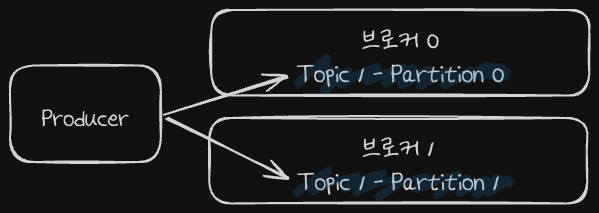
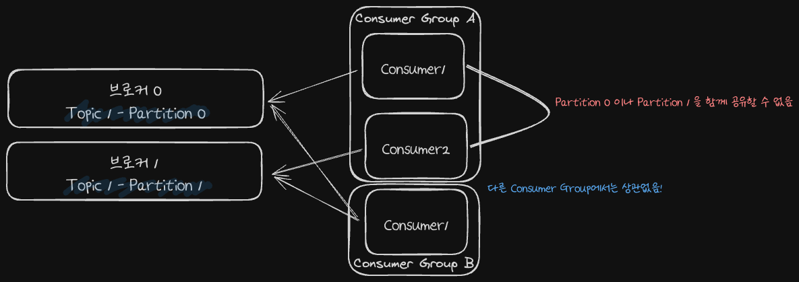

# 파티션과 프로듀서 & 컨슈머

## 파티션과 프로듀서

> 같은 토픽(주제)인 데이터가 파티션 0과 1에 분산되어 저장된다. 이를 결정하는 것을 프로듀서가 한다.

- 프로듀서는 어떤 Partition에 메시지를 저장할지 결정해야합니다.
  1. 메시지 키가 제공되지 않은 경우 RoundRobin 방식으로 돌아가면서 저장할 수 있습니다.
  2. Key를 이용해 특정 Partition을 선택할 수 있습니다.
    - Key가 지정된 경우 Kafka는 키의 해시값을 이용해 메시지를 특정 파티션에 저장합니다.
    - 같은 키를 갖는 메시지는 항상 같은 Partition에 저장되기 때문에 메시지 순서가 보장됩니다.

### 라운드 로빈(RoundRobin) 방식
라운드 로빈은 프로듀서가 메시지를 각 파티션에 고르게 분산시키기 위해 사용하는 방식 중 하나입니다. 이 방식은 다음과 같이 동작합니다:
- 메시지 분산: 프로듀서는 첫 번째 메시지를 첫 번째 파티션에, 두 번째 메시지를 두 번째 파티션에 저장하는 식으로 순차적으로 파티션에 메시지를 분산합니다.
- 순환 반복: 모든 파티션에 한 번씩 메시지를 보낸 후 다시 첫 번째 파티션으로 돌아가서 동일한 순서로 메시지를 보냅니다. 즉, 파티션의 개수만큼 순환하면서 메시지를 저장합니다. 

## 파티션과 컨슈머

> 특정 토픽(Topic 1)을 원하는 컨슈머들은 각기 다른 컨슈머 그룹을 구성하여 브로커와 연결을 통해 컨슈머가 메시지를 수신받습니다.

- 컨슈머는 **컨슈머 그룹**에 속하게 됩니다.
- 한개의 파티션은 컨슈머 그룹에서 한개 컨슈머만 연결 가능합니다.
  - 컨슈머 그룹에 속한 컨슈머들은 하나의 파티션을 공유 할 수 없습니다.
  - 한 컨슈머 그룹 기준으로 파티션의 메시지를 순서대로 처리하게 됩니다.

- 그림 예시를 살펴보면 Consumer Group A에서 각 컨슈머는 Partition0과 Partition1을 공유할 수 없습니다.
- 다른 Consumer Group B는 Consumer Group A에서 읽고있는 Partition0과 Partition1을 읽을 수 있습니다.

### 컨슈머 그룹을 사용하는 이유
1. 확장성과 병렬처리
   - **부하분산**: 컨슈머 그룹을 사용하면 여러 컨슈머를 그룹으로 묶어, 각 컨슈머가 토픽의 서로 다른 파티션을 병렬로 처리할 수 있습니다. 이를 통해 데이터 처리 속도가 크게 향상됩니다.
   - **확장성**: 처리해야 할 데이터 양이 증가하면 컨슈머 그룹에 컨슈머를 추가하여 쉽게 확장할 수 있습니다. 새로운 컨슈머가 그룹에 추가되면, 카프카는 자동으로 파티션을 다시 할당하여 각 컨슈머가 처리할 데이터를 균등하게 분배합니다. 

2. 데이터 중복 방지
   - **고유처리**: 컨슈머 그룹 내의 각 컨슈머는 고유한 파티션을 할당받아 처리하므로, 동일한 파티션의 데이터를 여러 번 처리하지 않습니다. 이는 동일한 데이터를 여러 번 처리하는 중복 작업을 방지하여 효율성을 높입니다.
3. 장애 복구
   - **높은 가용성**: 컨슈머 그룹 내의 특정 컨슈머가 장애를 일으키면, 해당 컨슈머가 처리하던 파티션의 데이터는 다른 컨슈머에게 자동으로 할당 됩니다. 이를 통해 데이터 처리가 중단되지 않고 지속될 수 있습니다.
   - **자동 재할당**: 장애가 발생한 컨슈머가 다시 정상 작동하게 되면, 카프카는 자동으로 파티션을 재할당하게 됩니다. 

