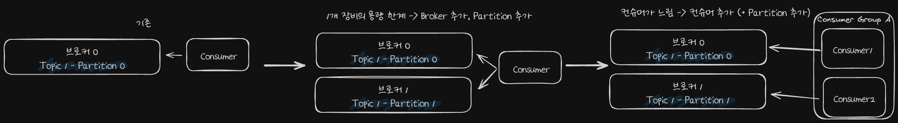

# 카프카 성능

## 카프카 성능이 좋은 이유

**Partition file은 OS 페이지캐시 사용**
- Partition에 대한 File IO를 메모리에서 처리합니다.
- 서버에서 Page Cache를 Kafka만 사용해야 성능에 유리합니다.

**Zero Copy**
- 디스크 버퍼에서 네트워크 버퍼로 직접 데이터 복사합니다.

**Consumer 추적을 위해 Broker가 하는 일이 비교적 단순**
- 메시지 필터, 메시지 재전송과 같은 일은 Broker가 하지않습니다. (Producer와 Consumer가 직접 함)
- Broker는 Consumer와 Partition간 매핑 관리합니다.

**묶어서 보내고, 받기 (Batch)**
- Producer: 일정 크기만큼 메시지를 모아서 전송 가능합니다.
- Consumer: 최소 크기만큼 메시지를 모아서 조회 가능합니다.

**처리량(throughput) 증대(확장)가 쉬움**
- 1개 장비의 용량 한계 -> Broker 추가, Partition 추가
- 컨슈머가 느림 -> 컨슈머 추가 (+ Partition 추가)

## Additional - Zero Copy

**일반적인 copy작업**
1. 데이터를 읽어 커널의 주소공간에 있는 Read buffer에 복사
2. 커널의 Read buffer에서 Apllication buffer로 데이터 복사
3. Application buffer에서 커널의 Socket buffer로 데이터 복사
4. Scoket buffer에서 NIC로 데이터 복사

**Zero-Copy**
1. 데이터를 읽어 커널의 주소공간에 있는 Read buffer에 복사
2. Read buffer데이터를 Socket buffer로 복사
3. NIC buffer로 복사

- 요약하자면 더 적은 복사횟수, 더 적은 Context Switching으로 불필요한 데이터 복사를 줄이고 CPU 자원을 아낄수 있다 입니다.

