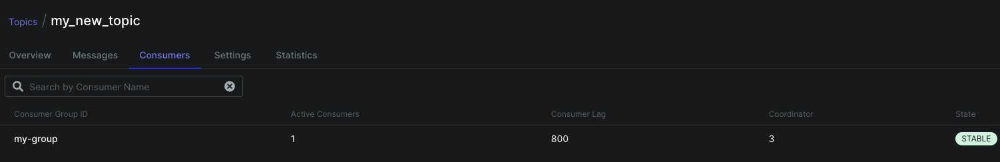
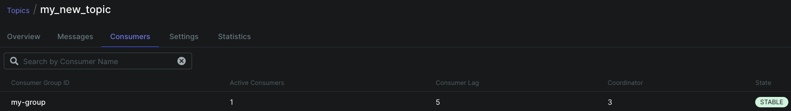

# Consumer 숫자에 따른 Lag 관찰

- [Infra Setting](https://github.com/ehddnr301/infra_hands_on)
- [Kafka Setting](https://github.com/ehddnr301/kafka_hands_on)

## 지연상황

- Kafka 동작 확인에 있어 관찰해볼 지연상황은 `lag`라는 지표입니다.
- `lag`: 프로듀서의 오프셋과 컨슈머의 오프셋간의 차이입니다.
- 생성되는 메시지양은 많은데 처리하는 Consumer는 적다면 Consumer가 데이터를 소비하고 처리하는 속도보다 Produce 되는 메시지양이 더 많기때문에 차이가 발생하게됩니다.

### Topic 설정


```python
from kafka.admin import KafkaAdminClient, NewTopic

# Kafka 관리자 클라이언트 생성
admin_client = KafkaAdminClient(
    bootstrap_servers=['broker-1:9092', 'broker-2:9092', 'broker-3:9092'],  # Kafka 브로커의 주소
    client_id='my_admin_client'  # 클라이언트 ID
)

# 생성할 새로운 토픽 설정
topic_list = []
topic_list.append(NewTopic(name="my_new_topic", num_partitions=9, replication_factor=2))

# 토픽 생성
admin_client.create_topics(new_topics=topic_list, validate_only=False)

# 관리자 클라이언트 종료
admin_client.close()
```

- `my_new_topic` 이라는 이름으로 토픽을 생성합니다.
- 이 토픽은 9개의 partition으로 나누어 저장되고 replication_factor값을 2로 가집니다.

### Producer 설정

```python
from kafka import KafkaProducer
import json

def json_serializer(data):
    return json.dumps(data).encode('utf-8')

producer = KafkaProducer(
    bootstrap_servers=['broker-1:9092', 'broker-2:9092', 'broker-3:9092'],
    value_serializer=json_serializer
)

def send_message(topic, message):
    producer.send(topic, message)
    producer.flush()

# 예제 메시지 전송
cnt = 1
while True:
    import time
    time.sleep(1)
    send_message('my_new_topic', {'cnt': f'cnt: {cnt}'})
    cnt += 1
```

- 1초마다 한번씩 cnt를 1씩 증가시켜가며 `my_new_topic`에 메시지를 생성하는 Producer입니다.

```yaml
apiVersion: apps/v1
kind: Deployment
metadata:
  name: kafka-producer
spec:
  replicas: 200
  selector:
    matchLabels:
      app: kafka-producer
  template:
    metadata:
      labels:
        app: kafka-producer
    spec:
      containers:
      - name: kafka-producer
        image: ehddnr/producer
        imagePullPolicy: Always
```

- 토픽에 대해 메시지를 생성하는 Producer를 `replicas: 200` 을 통해 200개를 생성합니다.

### Consumer 설정

```python
from kafka import KafkaConsumer
import json

def json_deserializer(data):
    return json.loads(data.decode('utf-8'))

consumer = KafkaConsumer(
    'my_new_topic',
    bootstrap_servers=['broker-1:9092', 'broker-2:9092', 'broker-3:9092'],
    auto_offset_reset='earliest',
    enable_auto_commit=True,
    group_id='my-group',
    value_deserializer=json_deserializer
)

for message in consumer:
    print(f"Received message: {message.value}")
```

- `my_new_topic`에 대해 메시지를 consume하는 consumer도 생성해줍니다.

```yaml
apiVersion: apps/v1
kind: Deployment
metadata:
  name: kafka-consumer
spec:
  replicas: 1
  selector:
    matchLabels:
      app: kafka-consumer
  template:
    metadata:
      labels:
        app: kafka-consumer
    spec:
      containers:
      - name: kafka-consumer
        image: ehddnr/consumer
        imagePullPolicy: Always
```

- 토픽에 대해 메시지를 컨슘하는 Consumer를 `replicas: 1` 을 통해 1개를 생성합니다.
- `lag` 관찰하기 위해 의도적으로 낮게 설정하였습니다.

### Lag 관찰



- 많은 Producer로부터 생성되는 메시지를 Consumer의 처리량이 따라가지못해 Consumer Lag 값이 오르는것을 관찰 할 수 있습니다.
- 현재는 Consumer에서 정의된 `json_deserializer` 함수가 단순하지만 더 복잡한 처리를 하게되면 더 Lag값이 올라갈 수 있습니다.



- `kubectl scale deployment kafka-consumer --replicas=9`
- partition갯수에 맞게 replicas갯수를 9까지 증가시켜 처리량을 올리게되면 Consumer Lag 값이 떨어지는것을 관찰 할 수 있습니다.