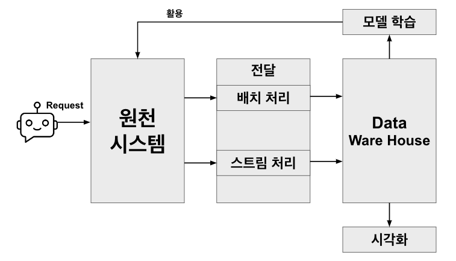
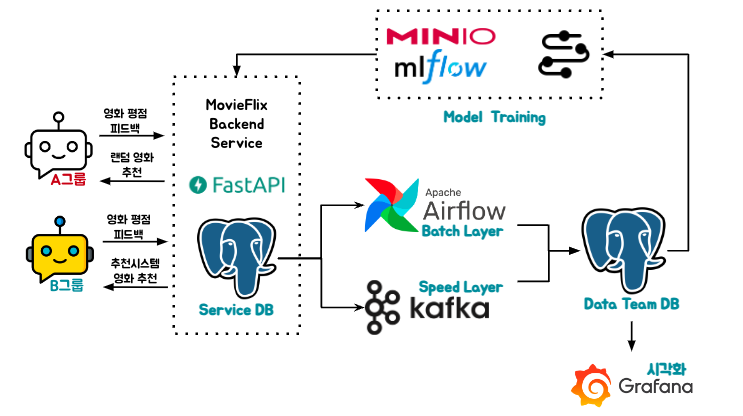

# 1. 아키텍처 설명

## 초기 구상

```
요구사항
    1. API서버를 통해 데이터가 Service DB에 생성.
    2. 실시간 데이터를 확인할 수 있는 데이터 아키텍처 설계.
    3. 데이터를 시각화 하여 확인가능 하도록 Monitoring DashBoard 생성.
    4. 적재된 데이터를 바탕으로 추천시스템 모델 학습.
```


- 위 요구사항에 맞게 우선 러프하게 아키텍처를 설계합니다.
- 데이터 아키텍처로는 `Lambda Architecture`를 채택하였습니다.

## 아키텍처 구체화



- 요구사항 1번을 만족시키기 위해서 `FastAPI & Postgresql`을 사용한 백엔드 서비스를 구성합니다.
- 요구사항 2번을 만족시키기 위해서 `Airflow & Kafka`를 사용한 간소화된 Lambda Architecture를 구성합니다.
- 요구사항 3번을 만족시키기 위해서 `Grafana`를 사용한 시각화를 구성합니다.
- 요구사항 4번을 만족시키기 위해서 `Airflow & MLFlow & Minio`를 사용한 Model Training 프로세스를 구성합니다.

## Lambda Architecture란

- 데이터를 처리함에 있어서 스트림과 배치라는 두 목적지로 전송하여 Batch Layer를 통해 대용량 데이터 처리를, Speed Layer를 통해 배치 레이어에서 생기는 갭을 채우는 아키텍처 입니다.
- ⚠️ 본 프로젝트에서는 구현상 편의를 위해 동일한 Source Table과 Target Table을 Kafka와 Airflow가 바라보게 구현되어 `실시간성`과 `배치를통한 데이터 부정확성 보완`을 구현하였습니다.

- 람다 아키텍처의 장점
    - `데이터 정확성`: Batch Layer를 통해 Speed Layer의 데이터 보정
    - `높은 내결함성`: Speed Layer와 Batch Layer가 분리되어 있기때문에 하나가 문제가 생기더라도 다른 계층에 영향을 끼치지 않습니다.

- 람다 아키텍처의 단점
    - `복잡성`: 두 개의 별도 계층을 관리해야 하므로 운영 복잡성이 높습니다.


<script src="https://utteranc.es/client.js"
        repo="Pseudo-Lab/data-engineering-for-everybody"
        issue-term="pathname"
        label="comments"
        theme="preferred-color-scheme"
        crossorigin="anonymous"
        async>
</script>