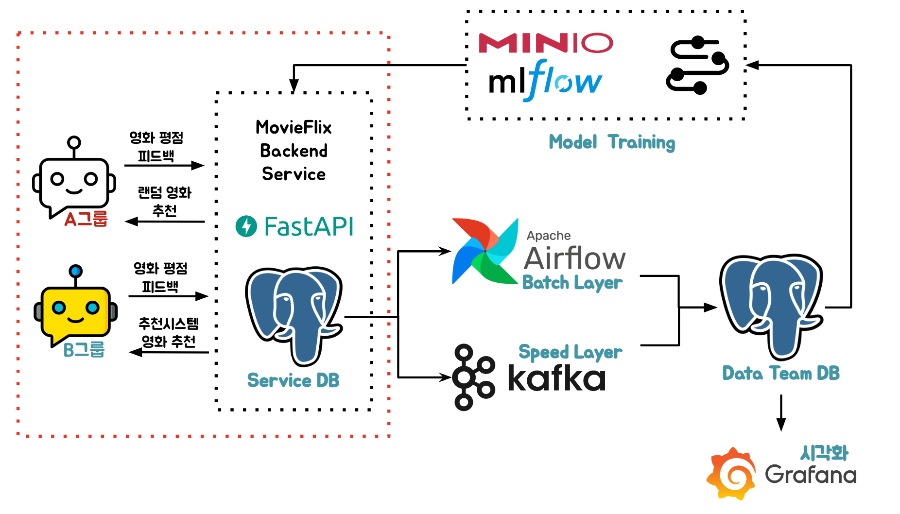

# 3. 데이터 생성



- Client Code에 의해 FastAPI에 Request를 보내 Service DB에 데이터를 생성합니다.

## Flow

```
데이터 Flow
    1. 영화 개봉
    2. 개봉한 영화를 보러 유저 방문
    3. 유저에게 영화 추천
    4. 추천 받은 영화에 대해 유저가 피드백 및 평점 리턴
```

## FastAPI

- MovieFlix 서비스에서 `새로운 영화 생성`, `평점 생성`, `유저 피드백 생성`을 위한 Backend 파트입니다.

- `새로운 영화 생성`
```python
# Router
@movie_router.post("/", status_code=status.HTTP_201_CREATED)
@inject
async def create_movie(
    request: CreateMovieRequest,
    movie_service: MovieService = Depends(Provide[Container.movie_service]),
):
    return await movie_service.create_movie(**request.model_dump())
```

- `평점 생성`
```python
# Router
@rating_router.post("/", status_code=status.HTTP_201_CREATED)
@inject
async def create_rating(
    request: CreateRatingRequest,
    rating_service: RatingService = Depends(Provide[Container.rating_service]),
):
    return await rating_service.create_rating(**request.model_dump())
```

- `유저 피드백 생성`
```python
# Router
@feedback_router.post("/", status_code=status.HTTP_201_CREATED)
@inject
async def create_feedback(
    request: CreateFeedbackRequest,
    feedback_service: FeedbackService = Depends(Provide[Container.feedback_service]),
):
    return await feedback_service.create_feedback(**request.model_dump())

# Service
async def create_feedback(
    self,
    user_id: int,
    recommended_movie_id_list: list[int],
    selected_movie_id: int,
    score: int = 0,
    user_type: str = "A",
    action_cycle: int = 0,
) -> FeedbackDomain:
    max_length = len(recommended_movie_id_list)  # recommended_movie_id_list의 최대 길이

    # 영화를 추천한 순서에 따라 앞쪽 순서에 추천되면 고점으로, 뒤쪽순서에 추천되면 저점으로 평가
    if selected_movie_id in recommended_movie_id_list:
        raw_score = len(
            recommended_movie_id_list
        ) - recommended_movie_id_list.index(selected_movie_id)
        score = (raw_score / max_length) * 10

    # Feedback 데이터 생성
    recommended_movie_id_list = ",".join(
        [str(movie_id) for movie_id in recommended_movie_id_list]
    )
    feedback = FeedbackDomain(
        user_id=user_id,
        recommended_movie_id_list=recommended_movie_id_list,
        selected_movie_id=selected_movie_id,
        score=score,
        user_type=user_type, # A/B 테스트에 활용될 유저그룹
        action_cycle=action_cycle,
    )
    return await self._repository.create(feedback=feedback)
```

## Client

```python
while True:
    movie = client_sender.pick_random_movie() # 1. 영화 개봉
    client_sender.send_movie_data(movie[0], movie[1], movie[2]) # 1. 영화 개봉
    movie_id = movie[0]
    users = client_sender.find_user_list_from_ratings(movie_id) # 개봉한 영화를 보러 유저 방문
    client_sender.send_user_reaction(CLIENT_WAIT_TIME, users, movie_id) # 추천 받은 영화에 대해 유저가 피드백 및 평점 리턴
```


<script src="https://utteranc.es/client.js"
        repo="Pseudo-Lab/data-engineering-for-everybody"
        issue-term="pathname"
        label="comments"
        theme="preferred-color-scheme"
        crossorigin="anonymous"
        async>
</script>