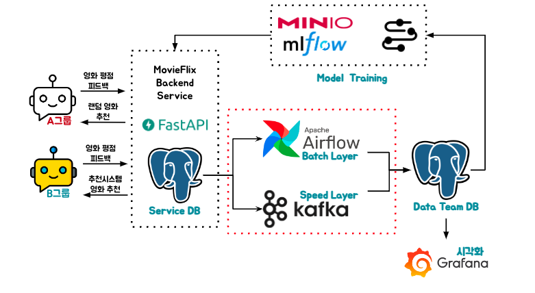

# 4. Data Flow



- 서비스 모니터링 및 Model Training을 위해 Data Team DB로 데이터를 옮기는 과정입니다.

## Airflow

- 람다 아키텍처에서 Batch Layer를 담당합니다.
    - 1시간마다 한번 테이블에서 kafka를 통해 생성된 데이터를 Delete 하고 Service DB에서 데이터를 읽어 Insert합니다.
    - kafka를 통해 생성된 데이터의 중복, 유실을 보정하기 위한 장치입니다.
- [Dag Repository](https://github.com/ehddnr301/MovieRecommender-DAGs)를 통해 Airflow Dag을 관리합니다.
- `git-sync` 를 통해 Repository에 반영된 코드만 Airflow에 반영될 수 있도록 합니다.

### Dynamic Dag Generation

```python
# 경로의 json파일을 읽어 해당 내용에 따라 Dag를 생성합니다.
for filename in os.listdir("/opt/airflow/dags/etl-dags"):
    if filename.endswith(".json"):
        dag_id = filename[:-5]
        with open(f"/opt/airflow/dags/etl-dags/{filename}", "r") as f:
            config = json.load(f)

        table_name = config["table_name"]
        schedule_interval = config["schedule_interval"]
        catchup = config.get("catchup", "False") == "True"
        start_date_str = config["start_date"]
        start_date = datetime.strptime(start_date_str, "%Y-%m-%d")

        globals()[dag_id] = DAG(
            dag_id,
            default_args=default_args,
            description=f"Load data into {table_name}",
            schedule_interval=schedule_interval,
            start_date=start_date,
            catchup=catchup,
            is_paused_upon_creation=False,
        )

        load_data_task = PythonOperator(
            task_id=f"load_data_into_{table_name}",
            python_callable=run_transfer,
            op_kwargs={"table_name": table_name},
            dag=globals()[dag_id],
        )
```

- 정형화된 로직에 따라 여러 Dag를 생성해야 할 경우 유용할 수 있습니다.


## Kafka

- 람다 아키텍처에서 Batch Layer를 담당합니다.
    - Airflow로 구현하기에 적절하지 않은 실시간 데이터 생성을 담당합니다.
- Source Connector를 사용하여 Source DB의 데이터를 브로커의 토픽으로 publish 합니다.
- Sink Connector를 사용하여 토픽의 데이터를 Subscribe하여 Target DB에 전달합니다.

- topic 구성 예시 `postgres-source-feedbacks`
```json
Source
    "table.whitelist": "feedbacks",
    "topic.prefix": "postgres-source-",
```
```json
Sink
    "topics": "postgres-source-feedbacks",
```

- `/MovieRecommend/project/kafka/connector_preprocess` 경로의 json파일을 구성해야합니다.

<script src="https://utteranc.es/client.js"
        repo="Pseudo-Lab/data-engineering-for-everybody"
        issue-term="pathname"
        label="comments"
        theme="preferred-color-scheme"
        crossorigin="anonymous"
        async>
</script>