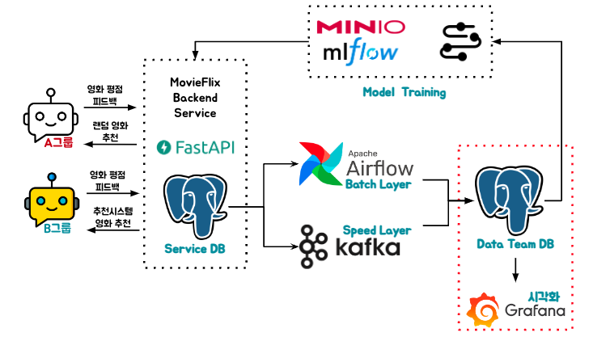
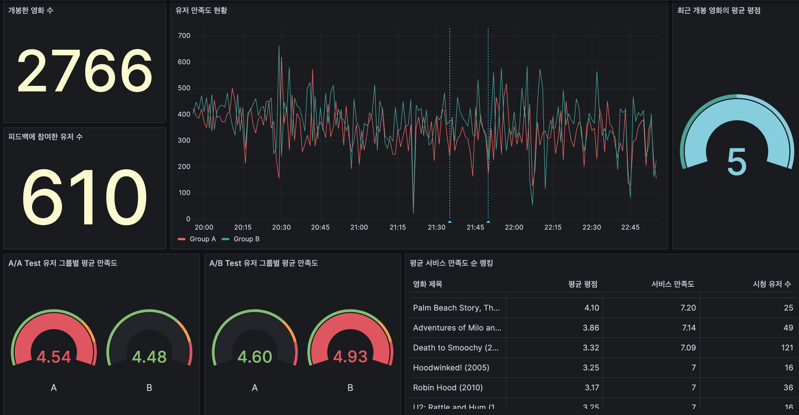
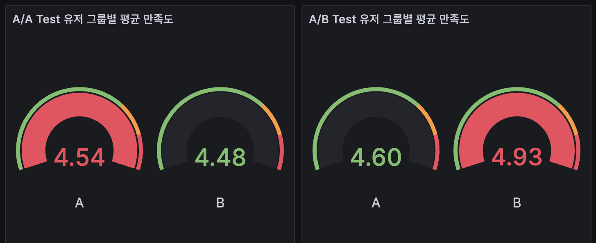

# 5. Monitoring

- `서비스 현황` 및 `유저만족도`를 모니터링 하기위한 대시보드 입니다.

## Grafana

- 시작에서 본것처럼 서비스현황을 모니터링 하기위한 대시보드를 구성해보았습니다.
    - [대시보드 파일](https://github.com/ehddnr301/MovieRecommend-K8s/blob/master/grafana/dashboard_file.json)을 활용합니다.
- 위 대시보드에서 `Gauge chart`를 한번 살펴보겠습니다.

### Why A/A Test Monitoring

- `A/A Test`: A그룹과 B그룹 모두에 영화 Random Recommendation
    - 만족도 차이 미미 (0.06)
    - 만족도에서 A그룹이 미세하게 우세
- `A/B Test`: A그룹에는 Random Recommendation, B그룹에는 추천시스템을 통한 추천을
    - 만족도 차이 증가 (0.33)
    - 만족도에서 B그룹이 역전

- `해석`
    - A/A Test 당시에는 평균 만족도가 비슷했던 두 그룹 -> 잘 Randomize된것으로 보입니다.
    - A/B Test를 시작하자 B그룹의 평균 만족도가 A그룹보다 개선된 것을 확인 -> Treatment가 유저 만족도 개선에 효과적인것으로 보입니다.

## 생각해 볼 점

- 이것이 현실 서비스 였다면 위 대시보드 만으로 우리의 Treatment가 효과적이었다고 할 수 있을지 생각해보면 좋을 것 같습니다.
    - 평균 만족도만 살펴서 괜찮은것인지?, B그룹내 특정 유저들만 만족도가 높아서 평균이 올라간 것은 아닌지?
    - 만족도에 영향을 주는 다른 변수는 없는것인지?, 담당자 실수로 B그룹 유저들에 쿠폰이 나감

