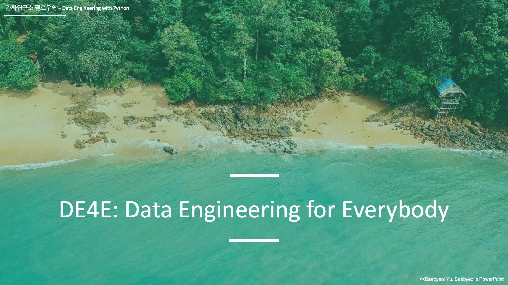

# DE4E: Data Engineering for Everybody
<!-- <h2 align="center">Data Engineering for Everybody</h2> -->

<!-- 
<i>DE4E: Data Engineering for Everybody by <a href="https://pseudo-lab.com/">Pseudo-Lab.</a></i>
 -->
<h4 align="center"><i>DE4E: Data Engineering for Everybody by <a href="https://pseudo-lab.com/">Pseudo-Lab.</a></i></h4>

 

<i>Loved the project? Please visit our <a href="https://pseudo-lab.github.io/data-engineering-for-everybody">Website</a></i>

 

> Welcome to our DE4E repository!  We aim to give you a complete understanding of data engineering, from fundamentals to advanced concepts. Whether you're new or experienced, our repository empowers data lovers with the knowledge and skills for success in the data-driven era. Join us on this exciting journey as we unlock the full potential of data engineering together!

<h2>DE4E: Data Engineering for Everybody</h2>

<h2>Acknowledgement 🙏</h2>

>**DE4E: Data Engineering for Everybody**는 가짜연구소의 DSF 프로그램에서 시작되었습니다. 시작에 앞서 감사의 말씀을 전합니다.

[가짜연구소](https://pseudo-lab.com/)는 DataCamp의 후원을 받아 Donates 프로그램을 진행하고 있습니다. 프로그램을 통해 구직자, 불완전 취업자, 비영리 연구 과학자, 학생분들께 DataCamp에서 제공하는 다양한 코스와 트랙을 제공합니다. 본 프로젝트는 DataCamp Donates 프로그램 중 하나인 [Data Science Fellowship](https://pseudo-lab.com/c9013228f63342b689a96e18c0db32c8)으로부터 시작되었습니다. 

DE4E는 데이터 분석가, 데이터 과학자, 데이터 엔지니어, 머신러닝 엔지니어가 함께 모여 데이터의, 데이터에 의한, 데이터를 위한 Data Engineering Repository를 만들어 나가고자 합니다.
  

<!-- 
click the above will guide you <a src='https://pseudo-lab.github.io/data-engineering-for-everybody'>DE4E Website!</a> -->

<!-- 

 -->

<h2>Contents</h2>

* [Self-Check List](https://pseudo-lab.github.io/data-engineering-for-everybody/docs/0_checklist/list.html)
* [Session 1. Introduction to Data Engineering](https://pseudo-lab.github.io/data-engineering-for-everybody/docs/1_introduction_to_data_engineering/main_page.html)
* [Session 2. Data Sources and Data Collection](https://pseudo-lab.github.io/data-engineering-for-everybody/docs/2_data_source_and_data_collection/template_main_page.html)
* [Session 3. Data Transformation and Cleaning](https://pseudo-lab.github.io/data-engineering-for-everybody/docs/3_data_transformation_and_cleaning/template_main_page.html)
* [Session 4. Data Storage](https://pseudo-lab.github.io/data-engineering-for-everybody/docs/4_data_storage/main_page.html)
* [Session 5. Data Processing Frameworks](https://pseudo-lab.github.io/data-engineering-for-everybody/docs/5_data_processing_frameworks_1/main_page.html)
* [Session 6. Data Processing Frameworks II](https://pseudo-lab.github.io/data-engineering-for-everybody/docs/6_data_processing_frameworks_2/template_main_page.html)
* [Session 7. Introduction to Apache Airflow]()
* [Session 8. Cloud Computing and Data Engineering](https://pseudo-lab.github.io/data-engineering-for-everybody/docs/8_cloud_computing_and_data_engineering/main_page.html)
* [Capstone Project(In Progress)]()
  

<h2>Schedule</h2>

| idx |    Date    |             Subject          |     Presenter  |       Pre-Question     |           Tag               | 
|----:|:-----------|:-----------------------------|:---------------|:---------------------- |:----------------------------|
| 0   | 2023-03-26 |[Session 0. Orientation ](url) | [이영전](https://github.com/Steve-YJ)| Why should we learn Data Engineering? | #OT #Direction # Motivation |
| 1   | 2023-04-02 |[Session 1. Introduction to Data Engineering ](url) | [이영전](https://github.com/Steve-YJ)| What is Data Engineering? | #Data Engineering #Discussion |
| 2   | 2023-04-09 |[Session 2. Data Sources and Data Collection](url) | [이동욱](https://github.com/ehddnr301), [김세현](https://github.com/sehyun-seankim)| How can we collect data from variaty sources? | #Source Data #Data Collection #Data Type #Structured Data #Unstructured Data #Batch Data #Real-time Data |
| 3   | 2023-04-16 |[Session 3. Data Transformation and Cleaning](url) | [이영전](https://github.com/Steve-YJ)| How can we transform data more efficiently? | #Data Processing |
| 4   | 2023-04-30 |[Session 4. Data Storage](url) | [송윤호](https://github.com/dbsgh2344), [전희선](https://github.com/heehehe)| How can we store data more efficiently? | #Data Store #Database #Data Lake #Lakehouse #Object-Storage #NoSQL |
| 5   | 2023-05-07 |[Session 5. Data Processing Frameworks](url) | [정경륜](https://github.com/ryuni-dev), [이화림](https://github.com/HWALIMLEE)| How data processing framework help us? | #Hadoop Eco-system #Parallel Computing |
| 6   | 2023-05-14 |[Session 6. Data Processing Frameworks II](url) | [김예신](https://github.com/yesinkim), [최한승](https://github.com/Henry-choi426)| Learn about various data processing framework | #Apache Spark #Apache Kafka #Apache Storm #Apache Flink |
| 7   | 2023-05-28 |[Session 7. Introduction to Apache Airflow](url) | 김성훈, [이희민](https://github.com/sainthm) | How can we schedule, orchestrate data processing? | #Apache Airflow #Tutorial |
| 8   | 2023-06-04 |[Session 8. Cloud Computing and Data Engineering](url) | [이민행](https://github.com/PacoLee33), [이영전](https://github.com/Steve-YJ)| What is Cloud Computing? and Why it is so important? | #Cloud Computing #Multi-Cloud #Data Engineering |
| 9   | 2023-06-18 |[Capstone Project](url) | [이화림](https://github.com/HWALIMLEE)| Let's dive into Data Engineering Capstone Proeject | #Capstone Project |
| 10  | 2023-07-09 - |[Project Management](url) | [전희선](https://github.com/heehehe), [정경륜](https://github.com/ryuni-dev), [이동욱](https://github.com/ehddnr301), [김예신](https://github.com/yesinkim)  | Build Together! | #Share #Motivation #Delighted to work together #Pseudo-Lab |
  

<h2>Contributors 😃</h2>

  

<h2>About us 👋🏼</h2>

[가짜연구소](https://pseudo-lab.com/)는 머신러닝, 데이터 사이언스, 데이터 엔지니어링을 중심으로 모인 비영리단체입니다. 누구나 원하는 연구를 할 수 있는 시작점이 되는, 진짜보다 더 진짜 같은 연구소를 꿈꾸고 있습니다. 공유(Share), 동기부여(Motivation), 함께하는 즐거움(Delighted to work together)라는 핵심가치를 추구하며 약 1800여 명의 연구원분들이 오늘도 함께 머신러닝, 데이터 사이언스, 데이터 엔지니어링 분야에 선한 영향력을 행사하고 있습니다. 보다 자세한 내용은 [여기](https://pseudo-lab.com/)서 살펴보실 수 있습니다.
  

<h2>License 🗞</h2>

This project is licensed under [MIT](https://opensource.org/licenses/MIT) license.